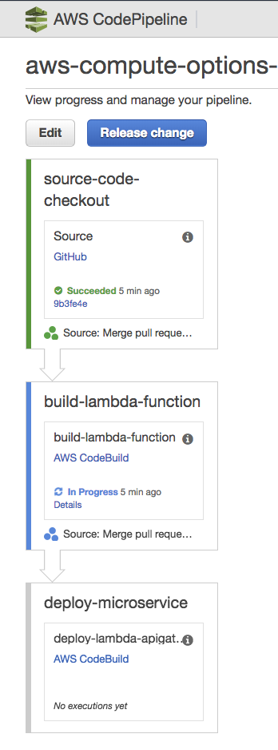

= Options for Deploying Microservices on AWS Compute
:toc:

This repo contains a simple application that consists of three microservices. The sample application uses three services:

. "`webapp`": Web application microservice uses "`greeting`" and "`name`"" microservice to generate a greeting for a person.
. "`greeting`": A microservice that returns a greeting.
. "`name`": A microservice that returns a person’s name based upon `{id}` in the URL.

Each application is deployed using different AWS Compute options. Each deployment model will highlight:

. Local dev, test and debug
. Remote debugging
. Service discovery
. Monitoring (possibly using X-Ray)
. Deployment pipeline

== Build and Test Services using Maven

Change to the "`services`" directory: `cd services`

. Greeting service in Terminal 1: `mvn -pl greeting wildfly-swarm:run -DskipTests`
.. Optionally test: `curl http://localhost:8081/resources/greeting`
. Name service in Terminal 2: `mvn -pl name wildfly-swarm:run -DskipTests`
.. Optionally test:
... `curl http://localhost:8082/resources/names`
... `curl http://localhost:8082/resources/names/1`
. Webapp service in Terminal 3: `mvn -pl webapp wildfly-swarm:run`
. Invoke the application in Terminal 4: `curl http://localhost:8080/`

== Build and Push Docker images

=== Create Docker image

`mvn -pl <service> package -DskipTests -Pdocker` where `<service>` is `greeting`, `name` or `webapp`

=== Docker image name

By default, the Docker image name is `arungupta/<service>`. Create the image in your repo as: `mvn -pl <service> package -Pdocker -Ddocker.repo=<repo>`

=== Push Docker images to registry

```
docker push <repo>/greeting
docker push <repo>/name
docker push <repo>/webapp
```

This is a workaround until https://github.com/aws-samples/aws-compute-options/issues/4 is fixed.

== Kubernetes

=== Deployment: Standalone Manifests

Make sure `kubectl` CLI is installed and configured for the Kubernetes cluster.

. Apply the manifests: `kubectl apply -f apps/k8s/standalone/manifest.yml`
. Access the application: `curl http://$(kubectl get svc/webapp -o jsonpath='{.status.loadBalancer.ingress[0].hostname}')`
. Delete the application: `kubectl delete -f apps/k8s/standalone/manifest.yml`

=== Deployment: Helm

Make sure `kubectl` CLI is installed and configured for the Kubernetes cluster. Also, make sure Helm is installed on that Kubernetes cluster.

. Install Helm CLI: `brew install kubernetes-helm`
. Install Helm in Kubernetes cluster: `helm init`
. Install Helm chart: `helm install --name myapp apps/k8s/helm/myapp`
. Access the application: `curl http://$(kubectl get svc/myapp-webapp -o jsonpath='{.status.loadBalancer.ingress[0].hostname}')`
. Delete Helm chart: `helm delete --purge myapp`

=== Deployment: Ksonnet

Make sure `kubectl` CLI is installed and configured for the Kubernetes cluster.

. Install `ksonnet` from `homebrew` tap: `brew install ksonnet/tap/ks`
. Change into the ksonnet sub directory: `cd apps/k8s/ksonnet/myapp`
. Add the environment: `ks env add default`
. Deploy the manifests: `ks apply default`
. Access the application: `curl http://$(kubectl get svc/webapp -o jsonpath='{.status.loadBalancer.ingress[0].hostname}')`
. Delete the application: `ks delete default`

=== Deployment: Docker Compose

https://github.com/aws-samples/aws-microservices-deploy-options/issues/62

=== Deployment: Kubepack

https://github.com/aws-samples/aws-microservices-deploy-options/issues/63

=== Deployment Pipeline: AWS Codepipeline

https://github.com/aws-samples/aws-microservices-deploy-options/issues/65

=== Deployment Pipeline: Jenkins

https://github.com/aws-samples/aws-microservices-deploy-options/issues/67

=== Deployment Pipeline: Spinnaker

https://github.com/aws-samples/aws-microservices-deploy-options/issues/66

=== Monitoring: AWS X-Ray

. `arungupta/xray:us-west-2` Docker image is already available on Docker Hub. Optionally, you may build the image:
+
```
cd config/xray
docker build -t arungupta/xray:latest .
docker image push arungupta/xray:us-west-2
```
+
. Deploy the DaemonSet: `kubectl apply -f xray-daemonset.yaml`
. Deploy the application using Helm charts
. Access the application
. Open the https://us-west-2.console.aws.amazon.com/xray/home?region=us-west-2#/service-map[X-Ray console] and watch the service map and traces. This is tracked as https://github.com/aws-samples/aws-microservices-deploy-options/issues/60[#60].

== Amazon Fargate

=== Deployment: Console and AWS CLI

https://github.com/aws-samples/aws-compute-options/issues/48

=== Deployment: CloudFormation and ECS CLI

1. See `requirements.txt` under `apps/ecs/ecs-cli/requirements.txt`

2. Run the following script  to setup a ECS Cluster, VPC, Subnets(Public/Private), Security Group, ALB(Public/Private), Target Groups

    ./infrastructure.sh

3. Once the stack completes, inspect the contents of this file `ecs-cluster.prop`

4. Configure ecs-cli

    ecs-cli configure --cluster $ECSCluster --region us-east-1 --default-launch-type FARGATE

5. Generate the ecs-params.yml for greeting service
    ./ecs-params-create.sh greeting

6. Bring the greeting service up. Note you should be in `greeting` directory now and should have greeting-docker-compose.yaml file in the same directory. Inspect the contents of the file

    ecs-cli compose --verbose --file greeting-docker-compose.yaml --task-role-arn $ECSRole \
    --ecs-params ecs-params_greeting.yml  service up --target-group-arn $GreetingTargetGroupArn 
    --container-name  greeting --container-port 8081

7. Generate the ecs-params.yml for name service

    cd .. && ./ecs-params-create.sh name

8. Bring the name service up

    ecs-cli compose --verbose --file name-docker-compose.yaml --task-role-arn $ECSRole \
    --ecs-params ecs-params_name.yml  service up --target-group-arn $NameTargetGroupArn 
    --container-name  name-service --container-port 8082

Go to the console and check the Target Group associated with Greeting service to make sure its healthy

9. Generate the ecs-params.yml for name service

    cd .. && ./ecs-params-create.sh webapp

10. Change the GREETING_SERVICE_HOST and NAME_SERVICE_HOST to the PrivateALBCName property (Get it from the ecs-cluster.prop a directory up or in CloudFormation Outputs tab)

11. Bring the webapp service up

    ecs-cli compose --verbose --file webapp-docker-compose.yaml --task-role-arn $ECSRole 
    --ecs-params ecs-params_webapp.yml  service up --target-group-arn $WebappTargetGroupArn 
    --container-name  webapp-service --container-port 8080

Go to the console and check the Target Group associated with Greeting service to make sure its healthy

If all of the above are executed successfully, curl the  PublicALBCNAME to see if you get a response

  curl http://aws-c-ALBPu-XXXXXXXXX-00000000.us-east-1.elb.amazonaws.com
  Hello Sheldon

=== Deployment: CloudFormation only

|===
|Region | Launch Template
| *N. Virginia* (us-east-1)
a| image::./images/deploy-to-aws.png[link=https://console.aws.amazon.com/cloudformation/home?region=us-east-1#/stacks/new?stackName=aws-compute-options-fargate&templateURL=https://s3.amazonaws.com/compute-options-public/master.yaml]
|===

Retrieve the public endpoint to test your application deployment:

```
aws cloudformation \
    describe-stacks \
    --region us-east-1 \
    --stack-name aws-compute-options-fargate \
    --query "Stacks[].Outputs[?OutputKey=='PublicALBCNAME'.[OutputValue]]" \
    --output text
```


== ECS

=== Deployment: Console and AWS CLI

https://github.com/aws-samples/aws-compute-options/issues/51

=== Deployment: CloudFormation and ECS CLI

https://github.com/aws-samples/aws-compute-options/issues/50

=== Deployment: CloudFormation only

|===
|Region | Launch Template
| *N. Virginia* (us-east-1)
a| image::./images/deploy-to-aws.png[link=https://console.aws.amazon.com/cloudformation/home?region=us-east-1#/stacks/new?stackName=aws-compute-options-ecs&templateURL=https://s3.amazonaws.com/aws-compute-options-bucket/master.yaml]
|===

Retrieve the public endpoint to test your application deployment:

```
aws cloudformation \
    describe-stacks \
    --region us-east-1 \
    --stack-name aws-compute-options-ecs \
    --query 'Stacks[].Outputs[?OutputKey==`PublicALBCNAME`].[OutputValue]' \
    --output text
```

Use the command to test:

```
curl http://<public_endpoint>
```

== AWS Lambda

=== Package Lambda Functions

. `cd services`
. `mvn clean package -Plambda`

=== Deploy Lambda + API Gateway via CodePipeline

. `cd apps/lambda`
. `aws cloudformation deploy --template-file pipeline.yaml --stack-name aws-compute-options-lambda-pipeline --capabilities CAPABILITY_IAM`
. `git remote add codecommit $(aws cloudformation describe-stacks --stack-name aws-compute-options-lambda-pipeline --query "Stacks[].Outputs[?OutputKey=='RepositoryHttpUrl'].OutputValue" --output text)`
. Setup your Git credential by following the https://docs.aws.amazon.com/codecommit/latest/userguide/setting-up-https-unixes.html[document]. This is required to push the code into the CodeCommit repo created in the CloudFormation stack. When the Git credential is setup, you can use the following command to push in the code and trigger the pieline to run.
+
```
git push codecommit master
```
+
. Get the URL to view the deployment pipeline:
+
```
aws cloudformation \
      describe-stacks \
      --stack-name aws-compute-options-lambda-pipeline \
      --query "Stacks[].Outputs[?OutputKey=='CodePipelineUrl'].[OutputValue]" \
      --output text
```
+
Deployment pipeline in AWS console looks like as shown:
+


=== Deploy SAM Manaully

. Create S3 bucket
+
```
aws s3api create-bucket \
  --bucket aws-compute-options \
  --region us-west-2 \
  --create-bucket-configuration LocationConstraint=us-west-2`
```
+
Make sure to change the bucket name.
+
. `cd apps/lambda`
. `sam package --template-file sam.yaml --s3-bucket YOUR-S3-BUCKET --output-template-file sam.transformed.yaml`
. `sam deploy --template-file sam.transformed.yaml --stack-name aws-compute-options-lambda --capabilities CAPABILITY_IAM`

=== Test SAM Local

==== In Mac

. `sam local start-api --template sam.yaml --env-vars test/env-mac.json`
. Greeting endpoint: `curl http://127.0.0.1:3000/resources/greeting`
. Name endpoint:
.. `curl http://127.0.0.1:3000/resources/names`
.. `curl http://127.0.0.1:3000/resources/names/1`
. Webapp endpoint: `curl http://127.0.0.1:3000/`

==== In Windows

. `sam local start-api --template sam.yaml --env-vars test/env-win.json`
. Test the urls above in browser

=== Test SAM on AWS

. Greeting endpoint:
+
```
curl `aws cloudformation \
  describe-stacks \
  --stack-name aws-compute-options-lambda \
  --query "Stacks[].Outputs[?OutputKey=='GreetingApiEndpoint'].[OutputValue]" \
  --output text`
```
+
. Name endpoint:
+
```
curl `aws cloudformation \
  describe-stacks \
  --stack-name aws-compute-options-lambda \
  --query "Stacks[].Outputs[?OutputKey=='NamesApiEndpoint'].[OutputValue]" \
  --output text`
```
+
. Webapp endpoint:
+
```
curl `aws cloudformation \
  describe-stacks \
  --stack-name aws-compute-options-lambda \
  --query "Stacks[].Outputs[?OutputKey=='WebappApiEndpoint'].[OutputValue]" \
  --output text`
```

=== Remove the stack

. `aws cloudformation delete-stack --stack-name aws-compute-options-lambda`

== Docker Swarm

=== Deployment

. `docker swarm init`
. `cd apps/docker`
. `docker stack deploy --compose-file docker-compose.yaml myapp`
. Access the application: `curl http://localhost:80`
.. Optionally test the endpoints:
... Greeting endpoint: `curl http://localhost:8081/resources/greeting`
... Name endpoint: `curl http://localhost:8082/resources/names/1`
. Remove the stack: `docker stack rm myapp`

=== Debug

. List stack:
+
```
$ docker stack ls
NAME                SERVICES
myapp               3
```
+
. List services in the stack:
+
```
$ docker stack services myapp
ID                  NAME                     MODE                REPLICAS            IMAGE                       PORTS
8hv33y3ry5la        myapp_greeting-service   replicated          1/1                 arungupta/greeting:latest   *:8081->8080/tcp
kyup1v84cv7q        myapp_name-service       replicated          1/1                 arungupta/name:latest       *:8082->8080/tcp
wcjhglfym28g        myapp_webapp-service     replicated          1/1                 arungupta/webapp:latest     *:80->8080/tcp
```
+
. List containers:
+
```
$ docker container ls -f name=myapp*
CONTAINER ID        IMAGE                       COMMAND                  CREATED             STATUS              PORTS                          NAMES
7cd2ec331b2a        arungupta/webapp:latest     "/deployments/run-ja…"   20 seconds ago      Up 20 seconds       8080/tcp, 8778/tcp, 9779/tcp   myapp_webapp-service.1.fvr9sae08ieu08lf8agfz2mwy
8436c6cc3110        arungupta/greeting:latest   "/deployments/run-ja…"   20 seconds ago      Up 18 seconds       8080/tcp, 8778/tcp, 9779/tcp   myapp_greeting-service.1.64idmwjlcvacniix6ll1egeoa
3a0a951f0a2d        arungupta/name:latest       "/deployments/run-ja…"   20 seconds ago      Up 20 seconds       8080/tcp, 8778/tcp, 9779/tcp   myapp_name-service.1.o7byxuzrc5vbfoyye8kuo19ws
```
+
. Get logs for all the containers in the `webapp` service:
+
```
$ docker service logs myapp_webapp-service
myapp_webapp-service.1.gb56vv5mw6u7@linuxkit-025000000001    | exec java -cp . -jar /deployments/webapp-swarm.jar
myapp_webapp-service.1.gb56vv5mw6u7@linuxkit-025000000001    | 2018-02-16 03:07:00,460 INFO  [org.wildfly.swarm] (main) WFSWARM0013: Installed fraction:                  Logging - STABLE          org.wildfly.swarm:logging:2018.2.0
myapp_webapp-service.1.gb56vv5mw6u7@linuxkit-025000000001    | 2018-02-16 03:07:00,514 INFO  [org.wildfly.swarm] (main) WFSWARM0013: Installed fraction:                  Elytron - STABLE          org.wildfly.swarm:elytron:2018.2.0
myapp_webapp-service.1.gb56vv5mw6u7@linuxkit-025000000001    | 2018-02-16 03:07:00,515 INFO  [org.wildfly.swarm] (main) WFSWARM0013: Installed fraction:                   JAX-RS - STABLE          org.wildfly.swarm:jaxrs:2018.2.0
myapp_webapp-service.1.gb56vv5mw6u7@linuxkit-025000000001    | 2018-02-16 03:07:00,516 INFO  [org.wildfly.swarm] (main) WFSWARM0013: Installed fraction:                 Undertow - STABLE          org.wildfly.swarm:undertow:2018.2.0
myapp_webapp-service.1.gb56vv5mw6u7@linuxkit-025000000001    | 2018-02-16 03:07:05,777 INFO  [org.jboss.msc] (main) JBoss MSC version 1.2.7.SP1
myapp_webapp-service.1.gb56vv5mw6u7@linuxkit-025000000001    | 2018-02-16 03:07:06,078 INFO  [org.jboss.as] (MSC service thread 1-8) WFLYSRV0049: WildFly Swarm 2018.2.0 (WildFly Core 3.0.8.Final) starting

. . .

org.jboss.as.server.deployment] (MSC service thread 1-5) WFLYSRV0027: Starting deployment of "webapp.war" (runtime-name: "webapp.war")
myapp_webapp-service.1.gb56vv5mw6u7@linuxkit-025000000001    | 2018-02-16 03:07:11,384 INFO  [org.wildfly.extension.undertow] (MSC service thread 1-5) WFLYUT0018: Host default-host starting
myapp_webapp-service.1.gb56vv5mw6u7@linuxkit-025000000001    | 2018-02-16 03:07:11,878 INFO  [org.jboss.resteasy.resteasy_jaxrs.i18n] (ServerService Thread Pool -- 10) RESTEASY002225: Deploying javax.ws.rs.core.Application: class org.wildfly.swarm.generated.WildFlySwarmDefaultJAXRSApplication
myapp_webapp-service.1.gb56vv5mw6u7@linuxkit-025000000001    | 2018-02-16 03:07:11,909 INFO  [org.wildfly.extension.undertow] (ServerService Thread Pool -- 10) WFLYUT0021: Registered web context: '/' for server 'default-server'
myapp_webapp-service.1.gb56vv5mw6u7@linuxkit-025000000001    | 2018-02-16 03:07:11,984 INFO  [org.jboss.as.server] (main) WFLYSRV0010: Deployed "webapp.war" (runtime-name : "webapp.war")
myapp_webapp-service.1.gb56vv5mw6u7@linuxkit-025000000001    | 2018-02-16 03:07:12,004 INFO  [org.wildfly.swarm] (main) WFSWARM99999: WildFly Swarm is Ready
```

== License

This library is licensed under the Amazon Software License.